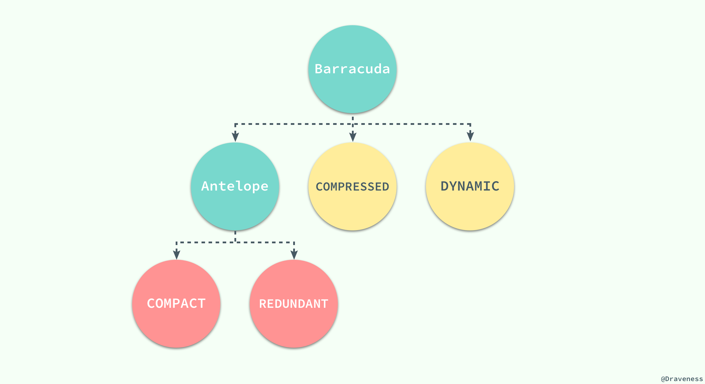

# InnoDB

## 数据存储

与现有的大多数存储引擎一样，InnoDB 使用页作为磁盘管理的最小单位；数据在 InnoDB 存储引擎中都是按行存储的，每个 `16KB` 大小的页中可以存放 `2-200` 行的记录。

当 InnoDB 存储数据时，它可以使用不同的行格式进行存储；MySQL 5.7 版本支持以下格式的行存储方式：



> `Antelope` 是 InnoDB 最开始支持的文件格式，它包含两种行格式 `Compact` 和 `Redundant` ，它最开始并没有名字； `Antelope` 的名字是在新的文件格式 `Barracuda` 出现后才起的， `Barracuda` 的出现引入了两种新的行格式 `Compressed` 和 `Dynamic` ；InnoDB 对于文件格式都会向前兼容，而官方文档中也对之后会出现的新文件格式预先定义好了名字：Cheetah、Dragon、Elk 等等。

两种行记录格式 `Compact` 和 `Redundant` 在磁盘上按照以下方式存储：


`Compact` 和 `Redundant` 格式最大的不同就是记录格式的第一个部分；在 `Compact` 中，行记录的第一部分倒序存放了一行数据中列的长度（Length），而 `Redundant` 中存的是每一列的偏移量（Offset），从总体上上看， `Compact` 行记录格式相比 `Redundant` 格式能够减少 `20%` 的存储空间。

### 行溢出数据

当 InnoDB 使用 `Compact` 或者 `Redundant` 格式存储极长的 `VARCHAR` 或者 `BLOB` 这类大对象时，我们并不会直接将所有的内容都存放在数据页节点中，而是将行数据中的前 `768` 个字节存储在数据页中，后面会通过偏移量指向溢出页。


但是当我们使用新的行记录格式 `Compressed` 或者 `Dynamic` 时都只会在行记录中保存 `20` 个字节的指针，实际的数据都会存放在溢出页面中。


当然在实际存储中，可能会对不同长度的 TEXT 和 BLOB 列进行优化。

> 想要了解更多与 InnoDB 存储引擎中记录的数据格式的相关信息，可以阅读 [InnoDB Record Structure](https://dev.mysql.com/doc/internals/en/innodb-record-structure.html)

### 数据页结构

页是 InnoDB 存储引擎管理数据的最小磁盘单位，而 `B-Tree` 节点就是实际存放表中数据的页面，我们在这里将要介绍页是如何组织和存储记录的；首先，一个 InnoDB 页有以下七个部分：


每一个页中包含了两对 `header/trailer`：内部的 `Page Header/Page Directory` 关心的是页的状态信息，而 `Fil Header/Fil Trailer` 关心的是记录页的头信息。

在页的头部和尾部之间就是用户记录和空闲空间了，每一个数据页中都包含 `Infimum` 和 `Supremum` 这两个虚拟的记录（可以理解为占位符）， `Infimum` 记录是比该页中任何主键值都要小的值， `Supremum` 是该页中的最大值：


`User Records` 就是整个页面中真正用于存放行记录的部分，而 `Free Space` 就是空余空间了，它是一个链表的数据结构，为了保证插入和删除的效率，整个页面并不会按照主键顺序对所有记录进行排序，它会自动从左侧向右寻找空白节点进行插入，行记录在物理存储上并不是按照顺序的，它们之间的顺序是由 `next_record` 这一指针控制的。

`B+` 树在查找对应的记录时，并不会直接从树中找出对应的行记录，它只能获取记录所在的页，将整个页加载到内存中，再通过 `Page Directory` 中存储的稀疏索引和 `n_owned、next_record` 属性取出对应的记录，不过因为这一操作是在内存中进行的，所以通常会忽略这部分查找的耗时。

## 索引

索引是数据库中非常非常重要的概念，它是存储引擎能够快速定位记录的秘密武器，对于提升数据库的性能、减轻数据库服务器的负担有着非常重要的作用；**索引优化是对查询性能优化的最有效手段**，它能够轻松地将查询的性能提高几个数量级。

InnoDB 存储引擎在绝大多数情况下使用 B+ 树建立索引，这是关系型数据库中查找最为常用和有效的索引，但是 **B+ 树索引并不能找到一个给定键对应的具体值，它只能找到数据行对应的页**，然后正如上一节所提到的，数据库把整个页读入到内存中，并在内存中查找具体的数据行。


B+ 树是平衡树，它查找任意节点所耗费的时间都是完全相同的，比较的次数就是 B+ 树的高度；

### 聚集索引和辅助索引

数据库中的 B+ 树索引可以分为聚集索引（clustered index）和辅助索引（secondary index），它们之间的最大区别就是，聚集索引中存放着一条行记录的全部信息，而辅助索引中只包含索引列和一个用于查找对应行记录的『书签』。

#### 聚集索引

InnoDB 存储引擎中的表都是使用索引组织的，也就是按照键的顺序存放；聚集索引就是按照表中主键的顺序构建一颗 B+ 树，并在叶节点中存放表中的行记录数据。

```
CREATE TABLE users(
    id INT NOT NULL,
    first_name VARCHAR(20) NOT NULL,
    last_name VARCHAR(20) NOT NULL,
    age INT NOT NULL,
    PRIMARY KEY(id),
    KEY(last_name, first_name, age)
    KEY(first_name)
);
```

如果使用上面的 SQL 在数据库中创建一张表，B+ 树就会使用 id 作为索引的键，并在叶子节点中存储一条记录中的所有信息。


> 图中对 B+ 树的描述与真实情况下 B+ 树中的数据结构有一些差别，不过这里想要表达的主要意思是：**聚集索引叶节点中保存的是整条行记录，而不是其中的一部分**。

聚集索引与表的物理存储方式有着非常密切的关系，所有正常的表应该 **有且仅有一个** 聚集索引（绝大多数情况下都是主键），表中的所有行记录数据都是按照 **聚集索引** 的顺序存放的。

当我们使用聚集索引对表中的数据进行检索时，可以直接获得聚集索引所对应的整条行记录数据所在的页，不需要进行第二次操作。

#### 辅助索引

数据库将 **所有的非聚集索引都划分为辅助索引**，但是这个概念对我们理解辅助索引并没有什么帮助；辅助索引也是通过 B+ 树实现的，但是它的叶节点并不包含行记录的全部数据，仅包含索引中的所有键和一个用于查找对应行记录的『书签』，在 InnoDB 中这个书签就是当前记录的主键。

辅助索引的存在并不会影响聚集索引，因为聚集索引构成的 B+ 树是数据实际存储的形式，而辅助索引只用于加速数据的查找，所以一张表上往往有多个辅助索引以此来提升数据库的性能。

> 一张表一定包含一个聚集索引构成的 B+ 树以及若干辅助索引的构成的 B+ 树。


如果在表 `users` 中存在一个辅助索引 (`first_name, age`)，那么它构成的 B+ 树大致就是上图这样，按照 (first_name, age) 的字母顺序对表中的数据进行排序，当查找到主键时，再通过聚集索引获取到整条行记录。


上图展示了一个使用辅助索引查找一条表记录的过程：通过辅助索引查找到对应的主键，最后在聚集索引中使用主键获取对应的行记录，这也是通常情况下行记录的查找方式。

## [InnoDB 锁机制](https://segmentfault.com/a/1190000014133576)


InnoDB默认使用行锁，实现了两种标准的行锁——共享锁与排他锁；

|行锁类型| 锁功能|锁兼容性|  加锁|释放锁|
| :------------- | :------------- |
|共享锁（读锁、S锁）| 允许获取共享锁的亊务读数据|与共享锁兼容，与排它锁不兼容| 只有 `SerializaWe` 隔离级别会默认为：读加共享锁；其他隔离级别下，可显示使用 `select...lock in share model` 为读加共享锁| 在事务提交或回滚后会自动同时释放锁；除了使用 `start transaction` 的方式显式开启事务，InnoDB 也会自动为增删改査语句开启事务，并自动提交或回滚；(`autocommit=1`)|
|排它锁（写锁、X锁）|允许获取排它锁的事务更新或删除数据|与共享锁不兼容，与排它锁不兼容|在默认的 `Reapeatable Read` 隔离级别下，InnoDB 会自动为增删改操作的行加排它锁；也可显式使用 `select...for update` 为读加排它锁|...|

>1. 除了显式加锁的情况，其他情况下的加锁与解锁都无需人工干预
>2. InnoDB 所有的行锁算法都是基于索引实现的，锁定的也都是索引或索引区间

### 当前读 & 快照读

**当前读**：即加锁读，读取记录的最新版本，会加锁保证其他并发事务不能修改当前记录，直至获取锁的事务释放锁；使用当前读的操作主要包括：**显式加锁的读操作与插入/更新/删除等写操作**，如下所示：

```
select * from table where ? lock in share mode;
select * from table where ? for update;
insert into table values (…);
update table set ? where ?;
delete from table where ?;
```

>注：当 `Update` SQL 被发给 `MySQL` 后， `MySQL Server` 会根据where条件，读取第一条满足条件的记录，然后 InnoDB 引擎会将第一条记录返回，并加锁，待 `MySQL Server` 收到这条加锁的记录之后，会再发起一个 `Update` 请求，更新这条记录。一条记录操作完成，再读取下一条记录，直至没有满足条件的记录为止。因此， `Update` 操作内部，就包含了当前读。同理， `Delete` 操作也一样。 `Insert` 操作会稍微有些不同，简单来说，就是 `Insert` 操作可能会触发 `Unique Key` 的冲突检查，也会进行一个当前读。

**快照读：即不加锁读，读取记录的快照版本而非最新版本，通过MVCC实现**；

InnoDB 默认的 `RR` 事务隔离级别下，不显式加`lock in share mode`与`for update`的 `select` 操作都属于快照读，保证事务执行过程中只有第一次读之前提交的修改和自己的修改可见，其他的均不可见；

### 共享锁与独占锁


### 意向锁

InnoDB 支持多粒度的锁，允许表级锁和行级锁共存。一个类似于 `LOCK TABLES ... WRITE` 的语句会获得这个表的 `x` 锁。为了实现多粒度锁，InnoDB 使用了意向锁（简称 I 锁）。I 锁是表明一个事务稍后要获得针对一行记录的某种锁（`s or x`）的对应表的表级锁，有两种：

  - 意向排它锁（简称 IX 锁）表明一个事务意图在某个表中设置某些行的 x 锁
  - 意向共享锁（简称 IS 锁）表明一个事务意图在某个表中设置某些行的 s 锁

`SELECT ... LOCK IN SHARE MODE` 设置一个 `IS` 锁, `SELECT ... FOR UPDATE` 设置一个 `IX` 锁。意向锁的原则如下：

  - 一个事务必须先持有该表上的 IS 或者更强的锁才能持有该表中某行的 S 锁
  - 一个事务必须先持有该表上的 IX 锁才能持有该表中某行的 X 锁

新请求的锁只有兼容已有锁才能被允许，否则必须等待不兼容的已有锁被释放。**一个不兼容的锁请求不被允许是因为它会引起死锁，错误会发生**。意向锁只会阻塞全表请求（比如 `LOCK TABLES ... WRITE` ）。**意向锁的主要目的是展示某人正在锁定表中一行，或者将要锁定一行**。

更多信息参见：[并发控制](concurrent_control.md)

###  Record Lock

记录锁（Record Lock）是加到**索引记录**上的锁，假设我们存在下面的一张表 `users`：

```
    CREATE TABLE users(
        id INT NOT NULL AUTO_INCREMENT,
        last_name VARCHAR(255) NOT NULL,
        first_name VARCHAR(255),
        age INT,
        PRIMARY KEY(id),
        KEY(last_name),
        KEY(age)
    );
```

如果我们使用 `id` 或者 `last_name` 作为 SQL 中 `WHERE` 语句的过滤条件，那么 InnoDB 就可以通过索引建立的 B+ 树找到行记录并添加索引，但是如果使用 `first_name` 作为过滤条件时，由于 InnoDB 不知道待修改的记录具体存放的位置，也无法对将要修改哪条记录提前做出判断就会锁定整个表。

###  Gap Lock

记录锁是在存储引擎中最为常见的锁，除了记录锁之外，InnoDB 中还存在间隙锁（Gap Lock），间隙锁是对索引记录中的一段连续区域的锁；当使用类似 `SELECT * FROM users WHERE id BETWEEN 10 AND 20 FOR UPDATE;` 的 SQL 语句时，就会阻止其他事务向表中插入 `id = 15` 的记录，因为整个范围都被间隙锁锁定了。

> 间隙锁是存储引擎对于性能和并发做出的权衡，并且只用于某些事务隔离级别。

虽然间隙锁中也分为共享锁和互斥锁，不过它们之间并不是互斥的，也就是不同的事务可以同时持有一段相同范围的共享锁和互斥锁，它唯一阻止的就是**其他事务向这个范围中添加新的记录**。

#### 间隙锁的缺点

  - 间隙锁有一个比较致命的弱点，就是当锁定一个范围键值之后，即使某些不存在的键值也会被无辜的锁定，而造成在锁定的时候无法插入锁定键值范围内的任何数据。在某些场景下这可能会对性能造成很大的危害
  - 当Query无法利用索引的时候， Innodb会放弃使用行级别锁定而改用表级别的锁定，造成并发性能的降低；
  - 当Quuery使用的索引并不包含所有过滤条件的时候，数据检索使用到的索引键所指向的数据可能有部分并不属于该Query的结果集的行列，但是也会被锁定，因为间隙锁锁定的是一个范围，而不是具体的索引键；
  - 当Query在使用索引定位数据的时候，如果使用的索引键一样但访问的数据行不同的时候（索引只是过滤条件的一部分），一样会被锁定


####  Next-Key Lock

Next-Key 锁相比前两者就稍微有一些复杂，它是记录锁和记录前的间隙锁的结合，在 `users` 表中有以下记录：

```
    +------|-------------|--------------|-------+
    |   id | last_name   | first_name   |   age |
    |------|-------------|--------------|-------|
    |    4 | stark       | tony         |    21 |
    |    1 | tom         | hiddleston   |    30 |
    |    3 | morgan      | freeman      |    40 |
    |    5 | jeff        | dean         |    50 |
    |    2 | donald      | trump        |    80 |
    +------|-------------|--------------|-------+
```


如果使用 Next-Key 锁，那么 Next-Key 锁就可以在需要的时候锁定以下的范围：

```
    (-∞, 21]
    (21, 30]
    (30, 40]
    (40, 50]
    (50, 80]
    (80, ∞)
```

> 既然叫 Next-Key 锁，锁定的应该是当前值和后面的范围，但是实际上却不是，Next-Key 锁锁定的是当前值和前面的范围。

当我们更新一条记录，比如 `SELECT * FROM users WHERE age = 30 FOR UPDATE;`，InnoDB 不仅会在范围 `(21, 30]` 上加 Next-Key 锁，还会在这条该记录索引增长方向的范围 `(30, 40]` 加间隙锁，所以插入 `(21, 40]` 范围内的记录都会被锁定。

> Next-Key 锁的作用其实是为了解决幻读的问题。

### 插入意向锁

插入意向锁是在插入一行记录操作之前设置的一种间隙锁，这个锁释放了一种插入方式的信号，亦即多个事务在相同的索引间隙插入时如果不是插入间隙中相同的位置就不需要互相等待。假设有索引值`4、7`，几个不同的事务准备插入`5、6`，每个锁都在获得插入行的独占锁之前用插入意向锁各自锁住了`4、7`之间的间隙，但是不阻塞对方因为插入行不冲突。

### 自增锁

自增锁是一个特殊的表级锁，事务插入自增列的时候需要获取，最简单情况下如果一个事务插入一个值到表中，任何其他事务都要等待，这样第一个事物才能获得连续的主键值。

### [锁选择](http://hedengcheng.com/?p=771#_Toc374698309)

```
+——-+————-+
| id | name |
+——-+————-+
| 1 | title1 |
+——-+————-+
| 2 | title2 |
+——-+————-+
| 3 | title3 |
+——-+————-+
| 9 | title9 |
+——-+————-+
| 10 | title10 |
+——-+————-+
```

按照原理来说，`id>5 and id<7`这个查询条件，在表中找不到满足条件的项，因此会对第一个不满足条件的项(`id = 9`)上加GAP锁，防止后续其他事务插入满足条件的记录。

而 **GAP 锁与GAP 锁是不冲突的**，那么为什么两个同时执行`id>5 and id<7`查询的事务会冲突呢？

原因在于，`MySQL Server`并没有将`id<7`这个查询条件下降到`InnoDB`引擎层，因此`InnoDB`看到的查询，是`id>5`，正向扫描。读出的记录`id=9`，先加上`next key锁`(Lock X + GAP lock)，然后返回给 MySQL Server 进行判断。
MySQL Server 此时才会判断返回的记录是否满足`id<7`的查询条件。此处不满足，查询结束。

因此，`id=9`记录上，真正持有的锁是`next key`锁，**而`next key`锁之间是相互冲突的**，这也说明了为什么两个`id>5 and id<7`查询的事务会冲突的原因。


## InnoDB 事务隔离

###  几种隔离级别

事务的隔离性是数据库处理数据的几大基础之一，而隔离级别其实就是提供给用户用于在性能和可靠性做出选择和权衡的配置项。

ISO 和 ANIS SQL 标准制定了四种事务隔离级别，而 InnoDB 遵循了 SQL:1992 标准中的四种隔离级别：`READ UNCOMMITED`、`READ COMMITED`、`REPEATABLE READ` 和 `SERIALIZABLE`；每个事务的隔离级别其实都比上一级多解决了一个问题：

  - `RAED UNCOMMITED`：使用查询语句不会加锁，可能会读到未提交的行（Dirty Read）；
    > 可以读取未提交记录。此隔离级别，不会使用，忽略。

  - `READ COMMITED`：只对记录加记录锁，而不会在记录之间加间隙锁，所以允许新的记录插入到被锁定记录的附近，所以再多次使用查询语句时，可能得到不同的结果（Non-Repeatable Read）；
    > 快照读忽略，本文不考虑。针对当前读，RC隔离级别保证对读取到的记录加锁 (记录锁)，存在幻读现象。

  - `REPEATABLE READ`：快照读忽略，本文不考虑。针对当前读，**RR隔离级别保证对读取到的记录加锁 (记录锁)，同时保证对读取的范围加锁，新的满足查询条件的记录不能够插入 (间隙锁)**，不存在幻读现象。

  - `SERIALIZABLE`：从MVCC并发控制退化为基于锁的并发控制。不区别快照读与当前读，所有的读操作均为当前读，读加读锁 (S锁)，写加写锁 (X锁)。
    > Serializable隔离级别下，读写冲突，因此并发度急剧下降，在MySQL/InnoDB下不建议使用。

MySQL 中默认的事务隔离级别就是 `REPEATABLE READ`，但是它通过 Next-Key 锁也能够在某种程度上解决幻读的问题。

![Transaction-Isolation-Matrix][images/15a2370c552e932907f8b2d3587171ef.png]

接下来，我们将数据库中创建如下的表并通过个例子来展示在不同的事务隔离级别之下，会发生什么样的问题：

```
    CREATE TABLE test(
        id INT NOT NULL,
        UNIQUE(id)
    );
```

###  脏读

> 在一个事务中，读取了其他事务未提交的数据。

当事务的隔离级别为 `READ UNCOMMITED` 时，我们在 `SESSION 2` 中插入的**未提交**数据在 `SESSION 1` 中是可以访问的。

![Read-Uncommited-Dirty-Read][images/e4696fae4a417bdd70dd04f0786647ed.png]

###  不可重复读

> 在一个事务中，同一行记录被访问了两次却得到了不同的结果。

当事务的隔离级别为 `READ COMMITED` 时，虽然解决了脏读的问题，但是如果在 `SESSION 1` 先查询了**一行**数据，在这之后 `SESSION 2` 中修改了同一行数据并且提交了修改，在这时，如果 `SESSION 1` 中再次使用相同的查询语句，就会发现两次查询的结果不一样。

![Read-Commited-Non-Repeatable-Read][images/d2d41261df71879fab0eb54771688d78.png]

不可重复读的原因就是，在 `READ COMMITED` 的隔离级别下，存储引擎不会在查询记录时添加行锁，锁定 `id = 3` 这条记录。

###  幻读

> 在一个事务中，同一个范围内的记录被读取时，其他事务向这个范围添加了新的记录。

重新开启了两个会话 `SESSION 1` 和 `SESSION 2`，在 `SESSION 1` 中我们查询全表的信息，没有得到任何记录；在 `SESSION 2` 中向表中插入一条数据并提交；由于 `REPEATABLE READ` 的原因，再次查询全表的数据时，我们获得到的仍然是空集，但是在向表中插入同样的数据却出现了错误。

![Repeatable-Read-Phantom-Read][images/b356bfdde7d52c6993a697c4529d2f6b.png]

这种现象在数据库中就被称作幻读，虽然我们使用查询语句得到了一个空的集合，但是插入数据时却得到了错误，好像之前的查询是幻觉一样。

在标准的事务隔离级别中，幻读是由更高的隔离级别 `SERIALIZABLE` 解决的，但是它也可以通过 MySQL 提供的 `Next-Key` 锁解决：

![Repeatable-with-Next-Key-Lock][images/8d3094a3893ae4d1806dfcb3a93b7dff.png]

`REPEATABLE READ` 和 `READ UNCOMMITED` 其实是矛盾的，如果保证了前者就看不到已经提交的事务，如果保证了后者，就会导致两次查询的结果不同，MySQL 为我们提供了一种折中的方式，能够在 `REPEATABLE READ` 模式下加锁访问已经提交的数据，其本身并不能解决幻读的问题，而是通过文章前面提到的 `Next-Key` 锁来解决。


## 参考连接

[『浅入浅出』MySQL 和 InnoDB](https://draveness.me/mysql-innodb)
